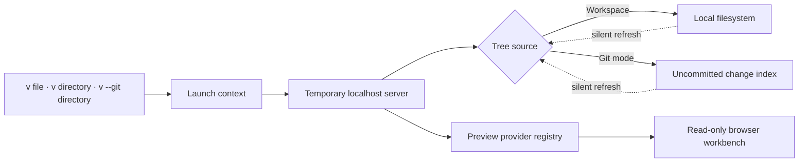

<div align="center">

# view

### Turn local files and uncommitted work into a focused browser review surface.

`view` is a local-first, read-only CLI for reading a file, exploring a workspace, or watching the exact set of changes that have not been committed yet.

<p>
  
  
  
  
  <a href="./LICENSE"></a>
</p>

<p>
  <a href="#why-view">Why view</a> ·
  <a href="#the-experience">Experience</a> ·
  <a href="#git-change-mode">Git mode</a> ·
  <a href="#installation">Installation</a> ·
  <a href="#usage">Usage</a> ·
  <a href="#design-principles">Design</a>
</p>

</div>

> [!TIP]
> Run `v .` inside any project to turn the current directory into a temporary, searchable reading workspace—without changing a single file.

## Why view?

Reading local work is surprisingly fragmented. A Markdown document belongs in a browser, source code belongs in an editor, an image needs a canvas, and an HTML file needs isolation. Reviewing an uncommitted change set adds another loop: run `git status`, locate a path, open it elsewhere, then repeat whenever the working tree changes.

`view` starts from a different premise:

> **Opening local work should be instant, format-aware, and safe enough to leave running beside your terminal.**

It is not another editor and it does not try to become one. It creates a temporary browser workspace that is optimized for reading. The interface stays quiet, the filesystem remains untouched, and each file is handed to a viewer designed for that format.

| Without `view` | With `view` |
| --- | --- |
| Switch between terminal, editor, image viewer, and browser | Use one consistent review surface |
| Re-run `git status` to rediscover active files | Watch the uncommitted tree update automatically |
| Carry editing controls into a reading task | Stay in an intentionally read-only workspace |
| Configure runtimes and global dependencies before trying the tool | Clone once and run `make install` |

## The experience

### One command, the right viewer

```bash
v README.md
v src/server.ts
v ./docs
```

The launch target becomes the browser tab title. A single file opens without a directory sidebar; a directory becomes a searchable, keyboard-navigable workspace. There is no view-mode selector to manage—the file type decides how it should be presented.

### A real code-reading surface

Source files and readable text open with line numbers, syntax highlighting, line wrapping, copy actions, stable scroll state, and compact metadata. All source content—including Python, Makefiles, JSON, shell scripts, YAML, Markdown code, and highlighted tokens—uses the bundled JetBrains Mono font.

### Native experiences beyond source code

| Content | Reading experience |
| --- | --- |
| Markdown | Sanitized document rendering, tables, relative links, and a live heading outline |
| Source code and text | Editor-style read-only view with line anchors and syntax highlighting |
| Images and SVG | Pannable canvas with fit, actual-size, and zoom controls |
| HTML | Sandboxed live preview isolated from the workspace shell |
| PDF | Full-size embedded document viewer |
| Other binary files | File metadata and an explicit download action |

Large text files are bounded to keep the browser responsive. File contents and already-open directory nodes refresh silently every five seconds without introducing status indicators or resetting the current reading position.

## Git change mode

Sometimes the repository is not what matters—the **change set** is.

```bash
v --git ./my-repository
v --git ./my-repository/src
# short form
v -g .
```

Git mode accepts a directory inside a repository and builds a live tree containing only files that have not been committed:

- staged changes;
- unstaged changes;
- untracked files;
- deleted working-tree files.

The scope may be the repository root or any subdirectory. Search, lazy directory expansion, preview providers, and the five-second refresh loop all operate on that filtered change set. Ordinary files receive no badges or decorative status labels—the tree remains as calm as the normal workspace.

Code files add one restrained signal in the line-number gutter:

| Gutter bar | Meaning |
| --- | --- |
| 🟩 Green | Line added since `HEAD` |
| 🟦 Blue | Existing line modified since `HEAD` |
| 🟥 Red | Deletion anchored at this position |

Deleted files remain discoverable in the tree and open into a clear deleted-file state instead of disappearing from the review context.

## Installation

### Fresh clone, one command

```bash
make install
```

This is the complete bootstrap path, not just a binary copy. It:

1. installs Bun into `~/.bun` when Bun is not already available;
2. installs the exact dependency graph from `bun.lock`;
3. runs TypeScript checks and the full test suite;
4. compiles a standalone executable with its frontend assets and JetBrains Mono embedded;
5. installs `v` to `~/.local/bin/v` without `sudo`;
6. configures PATH for zsh, bash, or fish;
7. starts a fresh login shell and verifies the installed command.

The installer is idempotent. Re-running it updates the binary and validates the project without duplicating shell configuration.

> [!NOTE]
> A working `make` command is required. If Bun is missing, the installer also needs `curl` or `wget` and network access. Locked packages require network access only when they are not already cached.

Install to another user-owned prefix when needed:

```bash
make install PREFIX="$HOME/tools"
```

## Usage

```text
Usage: v [options] [path]

Arguments:
  path                   File or directory to preview (default: ".")

Options:
  -p, --port <number>    Use a fixed local port
  -g, --git <directory>  Show only uncommitted files under a Git directory
  --no-open              Start the server without opening a browser
  -V, --version          Print the installed version
  -h, --help             Show command help
```

### Common workflows

```bash
# Read one file without an explorer sidebar
v ./README.md

# Browse an entire local workspace
v ./project

# Review only the uncommitted work in a repository
v --git ./project

# Narrow Git review to one package or source directory
v --git ./project/packages/api

# Start on a predictable port without opening a tab
v ./project --port 3000 --no-open
```

### Keyboard and interaction

| Action | Shortcut or gesture |
| --- | --- |
| Filter the file tree | `/` |
| Toggle the explorer | `Ctrl+B` / `Cmd+B` |
| Navigate the tree | Arrow keys, `Home`, `End`, `Enter` |
| Link directly to a source line | Click a line number |
| Wrap long source lines | Use the wrap action in a code view |
| Zoom an image | `+`, `-`, `0`, `F`, or modifier + wheel |

## Design principles

### Local first

The server binds to `127.0.0.1`. Files are read directly from the launch scope; there is no upload step, cloud workspace, account, or remote index.

### Read only by construction

There are no save operations, write APIs, or editing state. Markdown is sanitized, HTML runs through a sandboxed route, and the workspace exists only to present local content.

### Format behavior belongs to providers

Classification, preview generation, and browser rendering are separated by provider registries. A format owns its reading behavior and state, while the application shell remains small and consistent.

### Background behavior should disappear

Refreshes are silent. Single-file mode never asks for a directory tree. Browser throttling and computer sleep are not interpreted as a closed tab. A background server exits after the last tab explicitly closes, with a twelve-hour maximum lifetime as a final safety bound.

## How it works



The browser receives a small launch context and asks only for the tree nodes and previews it needs. Git commands are isolated behind a short-lived change index, while format-specific providers handle Markdown, code, HTML, images, PDF, binary files, and deleted-file states.

## Reliability and safety

- **Local binding:** the HTTP server listens on localhost only.
- **Path containment:** requests are resolved within the selected launch root.
- **No premature sleep shutdown:** server lifetime does not depend on browser heartbeats.
- **Bounded previews:** large text files are truncated before rendering.
- **HTML isolation:** live HTML runs with sandbox and content-security restrictions.
- **Deterministic installation:** dependency installation uses the committed lock file.
- **Standalone delivery:** the installed executable includes its runtime and frontend assets.

## Development

```bash
# Install locked development dependencies
make deps

# Run type checks and tests
make check

# Start from source
bun run dev -- ./path

# Compile the standalone executable
make build
```

When adding a new previewable format, keep the provider boundary intact: classification and payload generation belong on the server side; rendering and viewer state belong in the browser provider. Before submitting a change, run `make check` and finish with `make install` to validate the real installation path.

## Project status

`view` is actively evolving around one goal: make local review feel immediate without turning a lightweight viewer into another development environment. The current release is `0.1.0`; feedback and focused contributions are welcome.

## License

Released under the [MIT License](./LICENSE).
